# blurry-ocl

# Run in Environment
```
uv run ...
```

# Full Run

```
nohup notirun.sh ./mpsdodo.py -g 2 -n 8 &
```

```
nohup notirun.sh ./mpsdodo.py -g 2 -n 8 \
    -r tune_strategy:EWC.oracle.abrupt.000 \
    -r tune_strategy:SI.oracle.abrupt.000 &

    -r tune_strategy:FT.oracle.abrupt.000 \

```

# Run Tests
```
uv run -m pytest
```

# Render LaTeX Tables to PNG
```
python render_tables.py --table-dir table --output-dir table --dpi 300 --border-pt 18
```

This reads `table/*.tex` and writes matching PNG files next to them.


```
uv run main.py 
```




```mermaid
flowchart LR
    A["p1_hp_strategy<br/>Phase 1: strategy HP search"] --> B["p1_update_configs<br/>Phase 1b: write best params"]
    B --> C["p1_eval<br/>Phase 1c: per-seed eval (seeds 0-4)"]
    C --> D["p1_error_stream<br/>Phase 1d: combine dd streams"]
    B --> E["p2_hp_detector<br/>Phase 2: detector HP search<br/>(non-oracle only)"]
    D --> E
    E --> F["p2_select_detector<br/>cache selected detector"]
    F --> G["p3_final_evaluation<br/>Phase 3: final eval (seeds 10-14)<br/>always oracle + selected detector"]
    G --> H["p4_aggregate_metrics<br/>Phase 4: aggregate metrics.csv"]

    %% artifact flow hints
    A -. produces .-> A1["best_params.yaml"]
    A1 -. consumed by .-> B
    C -. produces .-> C1["per-seed dd_metrics.pkl"]
    C1 -. combined into .-> D1["combined dd_metrics.pkl"]
    D1 -. consumed by .-> E
    E -. feeds studies for .-> F
    F -. writes .-> F1["selected_detector.json"]
    F1 -. read by .-> G
    G -. writes .-> G1["phase3_eval_done.json markers<br/>+ ocl_metrics.pkl/dd_metrics.pkl"]
    G1 -. consumed by .-> H
    H -. writes .-> H1["logs/final-eval/metrics.csv"]
```

## TODO

- [ ] Strategies
    - [ ] Add PN
    - [ ] Add DER++
    - [ ] How will I handle strategies that use substeps?
- [ ] Increase number of hpsearch trials.
- [ ] 